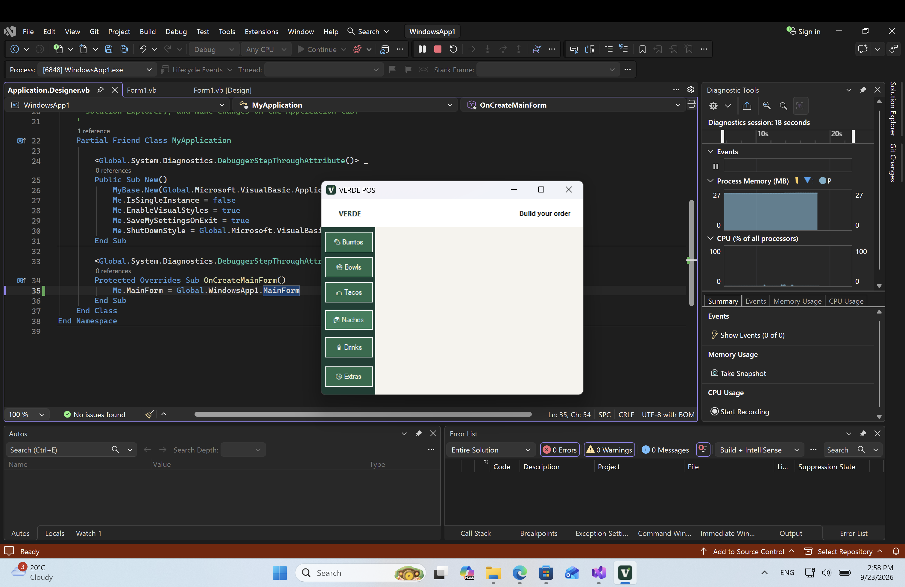

# VERDE POS

> A fresh, focused point-of-sale interface for building a quick restaurant order.



## At a glance

VERDE POS is a Windows Forms desktop prototype with a clean restaurant-inspired interface. Its category navigation keeps the ordering flow simple: choose a menu section, browse its products, and build an order.

| | |
| --- | --- |
| **Platform** | Windows desktop |
| **Framework** | .NET Framework 4.7.2 |
| **Language** | Visual Basic .NET |
| **UI** | Windows Forms |

## Interface

- **Branded header** — a crisp VERDE identity with a clear order-building prompt.
- **Menu categories** — Burritos, Bowls, Tacos, Nachos, Drinks, and Extras are always within reach.
- **Product area** — a dedicated scrollable space for displaying the selected category’s items.
- **Desktop-first design** — a compact point-of-sale layout built with standard WinForms controls.

## Run it

1. Clone the repository.
2. Open `WindowsApp1.slnx` in Visual Studio on Windows.
3. Select the `WindowsApp1` project and press <kbd>F5</kbd> to build and run.

### Requirements

- Windows
- Visual Studio with the **.NET desktop development** workload
- .NET Framework 4.7.2 targeting pack

## Project structure

```text
WindowsApp1.slnx              Solution
WindowsApp1/
├── Form1.vb                  Form behavior
├── Form1.Designer.vb         Interface layout and controls
├── Form1.resx                Form resources
├── Product.vb                Product model
└── WindowsApp1.vbproj        Project configuration
```

## Screenshot

The screenshot above shows the application running under the Visual Studio debugger, with the VERDE POS window centered in the workspace.
